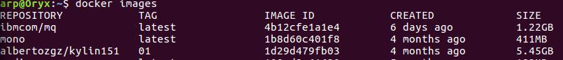
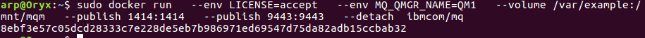
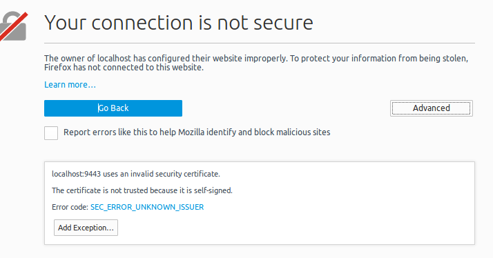
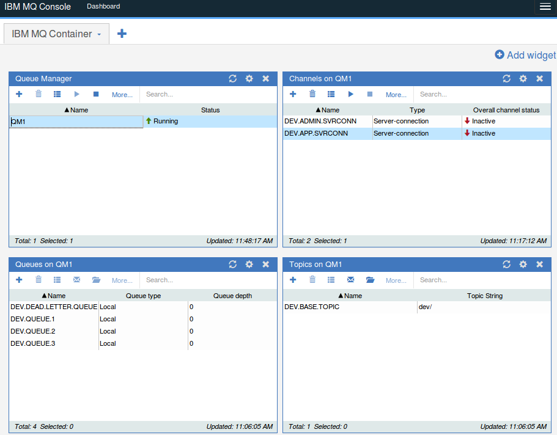
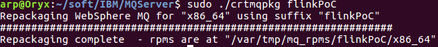

### Run IBM MQ
[Docker IBM MQ (non official)](https://hub.docker.com/r/ibmcom/mq/)

1- Download image from docker Hub:
```
docker pull ibmcom/mq
docker images
```



Check that the image has been donwloaded, Find the image name and imageID:

2- Run docker image:
```
sudo docker run   --env LICENSE=accept   --env MQ_QMGR_NAME=QM1   --volume /var/example:/mnt/mqm   --publish 1414:1414   --publish 9443:9443   --detach  ibmcom/mq
```
*ibmcom/mq is the name of the image in your system, you can use the first numebers of ImageID also, 4b12 in my case*


3- Check if MQ is running:
From docker host:
```
https://localhost:9443/ibmmq/console/
```

Accept the exception:


Login: admin Pasword: passw0rd


**Important:** If you are using MQ explorer from Virtual Box, you will need find the IP of contanier
```
docker inspect 8e
```
*8e it's the containerID in my sistem, you can use docker ps to find you*


In my case the IP is 172.17.0.2
```
https://172.17.0.2:9443/ibmmq/console
```


### Install & Run IBM MQ Explorer
[Documentation of IBM MQ and WebSpehe MQ](http://www-01.ibm.com/software/integration/wmq/library/?cm_mmc=Email-_-IBM+Cloud_API+Economy-_-WW_WW-_-APIe-MQ-eMail1_0WT_%20T_OFF_CB%20_LearnHow&cm_mmca1=000000WT&cm_mmca2=10000818&cm_mmca3=M00001777)

[IBM WebSphere MQ Evaluation, 90 days](https://www-01.ibm.com/marketing/iwm/iwm/web/download.do?source=ESD-WSMQ-EVAL&S_PKG=CRZC5ML&S_TACT=000000WT&lang=en_US&dlmethod=http)


1- Install pre-requisites
You must install pax or rpmbluild:
```
sudo rpm -i pax
sudo rpm -i rpm-build
```
2- Uncompress, accept license
This process also will check dependencies in our system
```
tar -xvzf IBM_MQ_9.0.0.0_LINUX_X86-64_TRIAL.tar.gz 
cd MQServer/
 ./mqlicense.sh 
```


3- Create package for install and install:
```
sudo ./crtmqpkg flinkPoC
cd  /var/tmp/mq_rpms/flinkPoC/x86_64
```



Install Client MQ on RPM systems:
```
rpm -ivh MQSeriesExplorer_flinkPoC-9.0.0-0.x86_64.rpm MQSeriesJRE_flinkPoC-9.0.0-0.x86_64.rpm MQSeriesRuntime_flinkPoC-9.0.0-0.x86_64.rpm 
```
